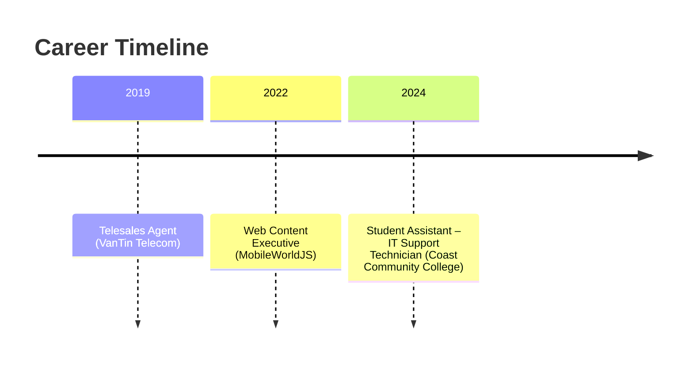

# 👋 Hi, I’m Thien An Truong  
Technical Support Specialist | IT Help Desk | Web Content Executive  

---

## 📚 Education
- **Associate of Science – Computer Science**  
  Orange Coast College (Expected 07/2026)  
- **Bachelor of Arts – Business Administration & Marketing**  
  University of Gloucestershire (05/2023)

---

## 🚀 What I Build / What I Do
- Deploy & manage Windows devices with Microsoft Intune  
- Resolve end‑user software/hardware issues (300+ tickets)  
- Create marketing content and maintain web listings  

---

## 🔧 Key Skills & Tools

| Tool | Proficiency |
|------|-------------|
| **Microsoft Intune** | Intermediate |
| **Jira** | Advanced |
| **AWS (VPC, S3, EC2, RDS)** | Intermediate |
| **HTML/CSS/JS** | Intermediate |

## 🏆 Certifications
- AWS Educate: Cloud 101, Networking, Security, Generative AI  
- CodePath: Intro to Web Development & Interview Prep  
- Aviatrix: Multicloud Network Associate

---

## 🏅 Awards & Honors
- Second Place – Vietnam Science & Engineering Fair (National)  
- First Place – Vietnam Science & Engineering Fair (Provincial)  
- Phi Theta Keta Honors Society

## 📂 Projects
- **DataStructure Alg Website Game** – [GitHub](https://github.com/AndrewTr0612/ds-algo-game)  
- **Web‑Content‑Exhibition‑Demo** – [Live Demo](https://delighting-clay-bicycle-337.vscodeedu.app)

---

## 📬 Get in Touch
📧 [andrewtrinfo0612@gmail.com](mailto:andrewtrinfo0612@gmail.com) | 🔗 [LinkedIn](https://www.linkedin.com/in/andrewtr0612/)  

---

## 🛠️ Languages & Tools

  
  
  
  
  
  
  
  
  
  
  
  
  
  
  

---

## 📊 GitHub Stats

  

